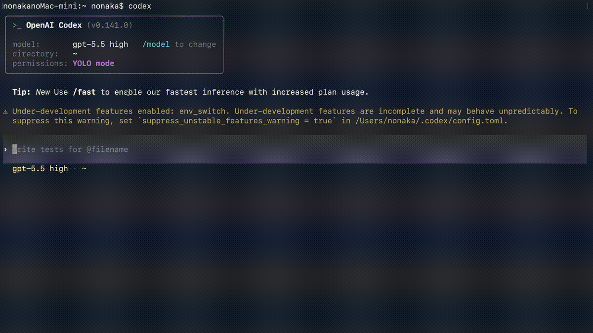

# Codex env_switch

このプロジェクトは Codex に `env_switch` ツールを持たせるための fork です。

`env_switch` は、人間が `ssh hoge` や `docker exec -it hoge bash` で別環境のシェルに入る体験を、Codex の組み込みツールにも与えるものです。

Codex にはファイル編集、画像読み取り、検索などの便利な組み込みツールがあります。しかし通常、それらはローカル環境にしか使えません。たとえば SSH 先のファイルを書き換える場合、Codex は `ssh host "..."` のような shell コマンドを書く必要があります。

この方法には次の問題があります。

- 毎回 `ssh` や `docker exec` を書くのでトークン効率が悪い
- shell の出力が曖昧になりやすい
- ファイル編集や画像読み取りなど、Codex の組み込みツールの強みを活かしにくい

`env_switch` は、Codex のツール実行先を SSH 先、Docker コンテナ内、さらにそのネスト環境へ切り替えられるようにします。

## Demo

TODO: デモ GIF を追加する。

```markdown

```

## Build

```shell
cd codex-rs
cargo build -p codex-cli --bin codex
```

ビルドした Codex を起動するには:

```shell
./target/debug/codex --yolo
```

## Demo GIF の撮影方法

macOS なら画面収録で動画を撮れます。

1. `Shift + Command + 5` を押す
2. 収録範囲を選ぶ
3. Codex で `env_switch` を使う様子を録画する
4. 保存された `.mov` を GIF に変換する

`ffmpeg` がある場合:

```shell
ffmpeg -i demo.mov -vf "fps=12,scale=1200:-1:flags=lanczos" docs/assets/env-switch-demo.gif
```

GIF を置くディレクトリがなければ作成します。

```shell
mkdir -p docs/assets
```
